# âge 社作品汉化补完计划

**AgeReVerse · 压抑同盟**

âge 游戏逆向研究、工具开发与中文本地化。

  <strong><a href="#游戏下载">补丁下载</a></strong> ·
  <a href="#部分作品实机预览">汉化效果</a> ·
  <a href="#其他作者的汉化入口">ATE 汉化（其他作者）</a> ·
  <a href="docs/player/README.md">安装、卸载与排错</a> ·
  <a href="localization-make-games-speak/README.md">学做汉化 / Localization</a> ·
  <a href="#research">制作与研究 / Research · English</a> ·
  <a href="#问题反馈">问题反馈</a>

提供 Muv-Luv 系列《TDA00—03》《帝都燃烧篇》《光子之花（PF）》《光子旋律（PM）》的 Steam 简体中文汉化补丁；《君望／你所期望的永远》Steam 版汉化正在制作中。

**七部作品已有 BETA 补丁下载，君望 Steam 版正在制作中**，持续完善译文、中文界面、字体与排版，并通过玩家反馈和协作校对更新。

**以完整汉化为目标，已发布补丁接近完整覆盖：剧情正文、菜单与设置、字幕，以及标题、按钮、说明、地图、年表、地点提示、手写道具和演出素材中的文字，一并进行中文化。**
汉化范围包含可编辑文本与嵌在图片中的文字，同时处理中文字体、换行、长字幕和原作的特殊排版。

补丁仍为 BETA，可能存在遗漏、原文残留或显示问题；发现后会继续修正、补齐，更新到后续版本。
各作的覆盖情况与已知问题不同，详见[汉化范围与实机截图](docs/player/screenshots.md)。

本项目非官方、非商业；另收录主任保护协会制作的 ATE 汉化原发布入口，方便查找。

当前提供 **TDA00—03（Muv-Luv UNLIMITED: The Day After）、帝都燃烧篇
（The Imperial Capital Burns）、光子之花（photonflowers*）、光子旋律（photonmelodies*）**
的独立补丁。系列日文名为 **マブラヴ**，也常写作 **MuvLuv / Muv Luv**；各作适用版本与安装方式不同。
见[作品名称与版本对照](docs/player/game-names.md)。补丁仍为 BETA，持续接受反馈与协作校对。

Unofficial Simplified Chinese (zh-Hans) patches for the Windows Steam releases of
Muv-Luv UNLIMITED: The Day After episodes 00–03, The Imperial Capital Burns,
Muv-Luv photonflowers* and photonmelodies*. See the download table below for each game's release.
Kimi ga Nozomu Eien ~Enhanced Edition~ and its Another Episode Collection+ are also in development; no Kiminozo patch has been released.
These are Chinese localization patches, not English patches or full games.
Localization covers dialogue, menus, settings, subtitles and text embedded in images,
aiming for comprehensive Chinese coverage while remaining omissions and display issues are corrected.

> [!IMPORTANT]
> 使用补丁必须拥有对应游戏正版。本仓库不提供游戏本体、破解或完整原始资源。
> TDA00–03 与帝都燃烧现提供新版 BETA 安装程序。安装与恢复步骤见
> [完整玩家指南](docs/player/README.md)；请保留存档，勿混用不同作品的补丁。

## 第一部分 · 玩家下载与反馈

### 补丁下载

请选择与你拥有的游戏完全对应的补丁。点击下表“下载汉化补丁”，解压后按安装说明操作；不要下载 GitHub 自动生成的 Source code ZIP。

| 游戏 | 当前公开版本 | 下载与说明 |
| --- | --- | --- |
| TDA00 | **BETA 0.2.1** | [下载汉化补丁](https://github.com/RepressedAlliance/AgeReVerse/releases/download/tda00-BETA-0.2.1/TDA00-CN-BETA-0.2.1-Complete.zip) · [发布说明](https://github.com/RepressedAlliance/AgeReVerse/releases/tag/tda00-BETA-0.2.1) |
| TDA01 | **BETA 0.3.3** | [下载汉化补丁](https://github.com/RepressedAlliance/AgeReVerse/releases/download/tda01-BETA-0.3.3/TDA01-CN-BETA-0.3.3-Patch.zip) · [发布说明](https://github.com/RepressedAlliance/AgeReVerse/releases/tag/tda01-BETA-0.3.3) |
| TDA02 | **BETA 0.2.1** | [下载汉化补丁](https://github.com/RepressedAlliance/AgeReVerse/releases/download/tda02-BETA-0.2.1/TDA02-CN-BETA-0.2.1-Patch.zip) · [发布说明](https://github.com/RepressedAlliance/AgeReVerse/releases/tag/tda02-BETA-0.2.1) |
| TDA03 | **BETA 0.2.7** | [下载汉化补丁](https://github.com/RepressedAlliance/AgeReVerse/releases/download/tda03-BETA-0.2.7/TDA03-CN-BETA-0.2.7-Patch.zip) · [发布说明](https://github.com/RepressedAlliance/AgeReVerse/releases/tag/tda03-BETA-0.2.7) |
| 帝都燃烧篇 | **BETA 0.2.1** | [下载汉化补丁](https://github.com/RepressedAlliance/AgeReVerse/releases/download/imperial-capital-burns-BETA-0.2.1/TM-CN-BETA-0.2.1-Patch.zip) · [发布说明](https://github.com/RepressedAlliance/AgeReVerse/releases/tag/imperial-capital-burns-BETA-0.2.1) |
| 光子之花 | **BETA 0.1.2** | **[下载汉化补丁](https://github.com/RepressedAlliance/AgeReVerse/releases/download/pf-BETA-0.1.2/MuvLuv_PF_CN_Patch_BETA_0.1.2.zip)** · [发布说明](https://github.com/RepressedAlliance/AgeReVerse/releases/tag/pf-BETA-0.1.2) |
| 光子旋律 | **BETA 0.1.2** | **[下载汉化补丁](https://github.com/RepressedAlliance/AgeReVerse/releases/download/pm-BETA-0.1.2/MuvLuv_PM_CN_Patch_BETA_0.1.2.zip)** · [发布说明](https://github.com/RepressedAlliance/AgeReVerse/releases/tag/pm-BETA-0.1.2) |
| 君望（含 Another Episode Collection+） | **制作中，尚未发布** | [项目介绍与进度](AGE2/games/kiminozo/README.md) |

> **也想让喜欢的游戏说你的语言？** [游戏本地化｜让游戏说你的语言 · Make Games Speak Your Language](localization-make-games-speak/README.md)：公开 AI 辅助文本翻译、图片汉化、字体排版、全文一致性和多人校对的方法，各入口可原地展开英文说明。

### 接近完整汉化 · 实机展示

**正文、界面、字幕与图片文字一并汉化，目标是游戏内可见内容的完整中文化。**
下面选取 **TDA00、TDA03、光子之花（PF）与光子旋律（PM）** 的十八张实机画面，
展示菜单、设置、手绘道具、地图与战术说明、地点提示、演出画面文字和振假名的中文处理。

#### 图片文字：地图、图解、年表与手写道具

图片中的文字也纳入汉化，包括手绘标记、机械说明、篇章标题、年表和道具上的手写文字。
TDA03 战术图采用中文标注与说明，画面保留原图中的日文。

<table>
  <tr><th width="50%">光子之花 · 手绘地图文字</th><th width="50%">光子之花 · 机械说明图</th></tr>
  <tr>
    <td width="50%"><a href="docs/player/screenshots/photonflowers/map.jpg">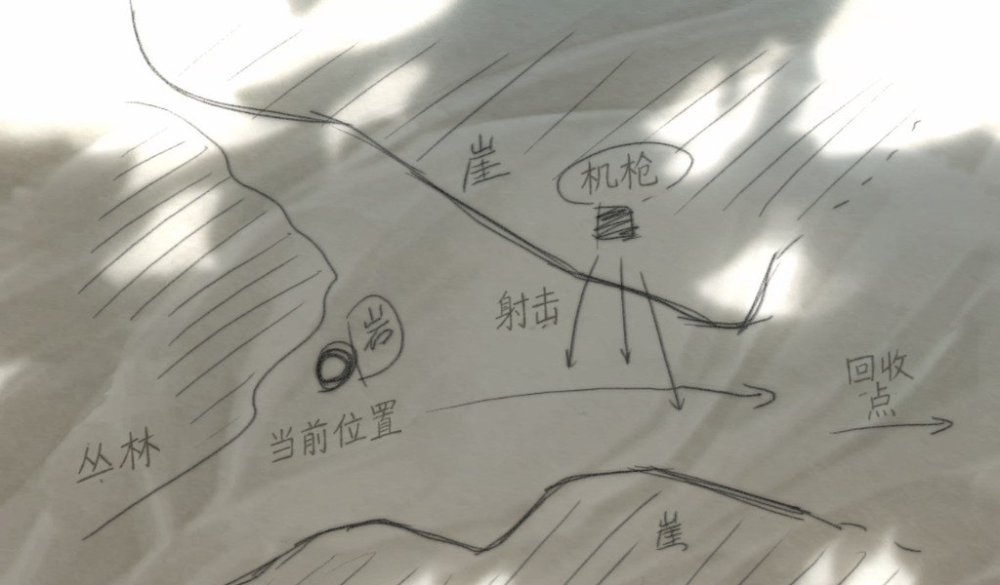</a></td>
    <td width="50%"><a href="docs/player/screenshots/photonflowers/mechanical-diagram.jpg">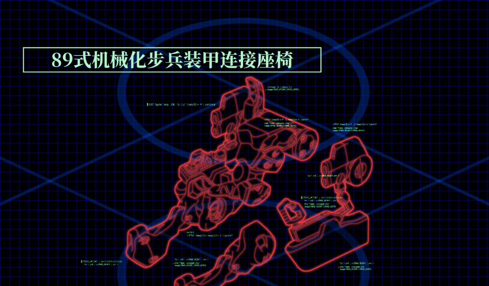</a></td>
  </tr>
</table>

<table>
  <tr><th width="50%">TDA03 · 战术图中文标注与说明</th><th width="50%">光子旋律 · 手写道具图片文字</th></tr>
  <tr>
    <td width="50%"><a href="docs/player/screenshots/tda03/tactical-map.jpg">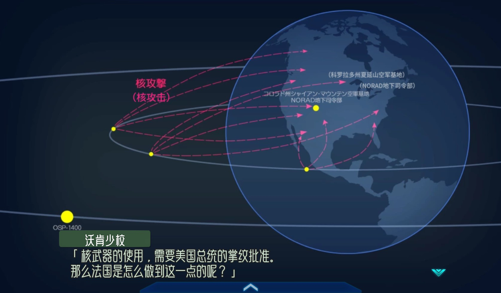</a></td>
    <td width="50%"><a href="docs/player/screenshots/photonmelodies/handwritten-note.jpg">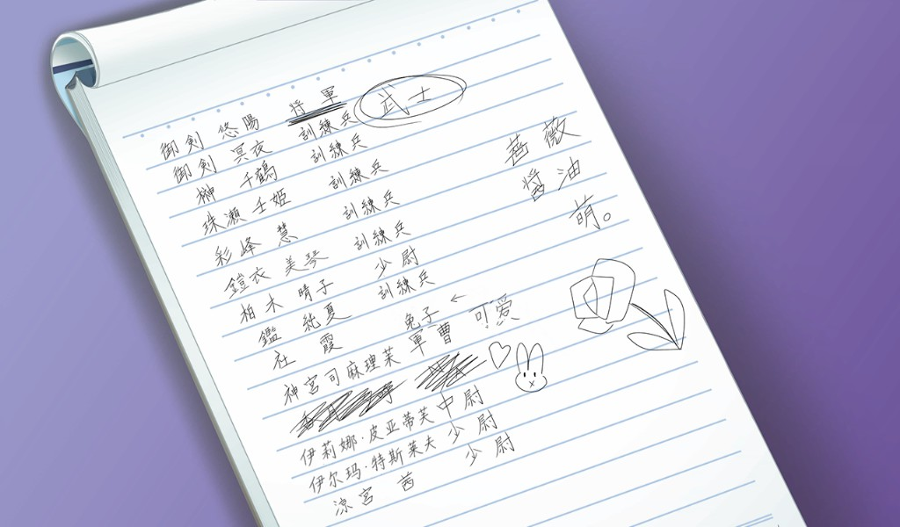</a></td>
  </tr>
</table>

<table>
  <tr><th width="50%">光子之花 · 年表与篇章标题</th><th width="50%">光子之花 · 故事介绍与图片标题</th></tr>
  <tr>
    <td width="50%"><a href="docs/player/screenshots/photonflowers/timeline.jpg">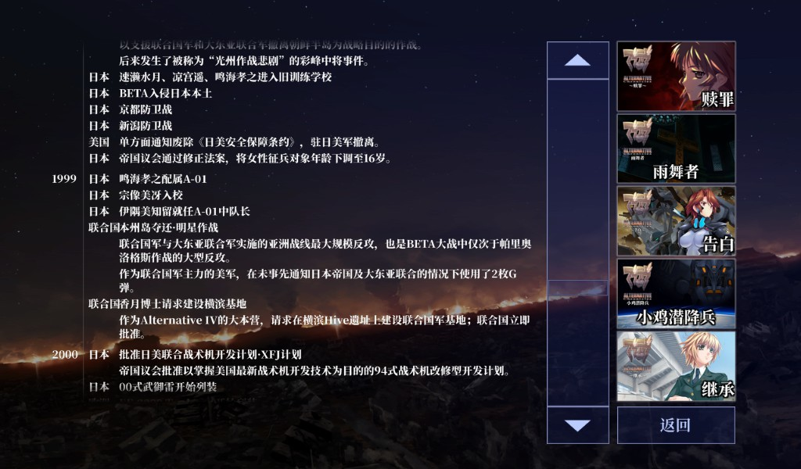</a></td>
    <td width="50%"><a href="docs/player/screenshots/photonflowers/story-selection.jpg">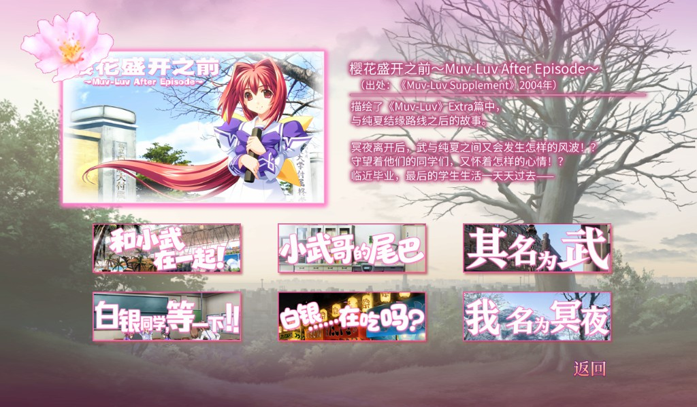</a></td>
  </tr>
</table>

#### 场景地点提示与动态演出中的文字

场景切换时的地点文字、驾驶舱演出中的地图标签和状态说明，也有对应的中文处理。
光子之花这张图为动态演出中的一帧，展示“通信”“状况解析”“佐渡岛周边”等中文文字。

<table>
  <tr><th width="50%">TDA03 · 场景地点提示</th><th width="50%">光子之花 · 驾驶舱演出文字</th></tr>
  <tr>
    <td width="50%"><a href="docs/player/screenshots/tda03/location-card.jpg">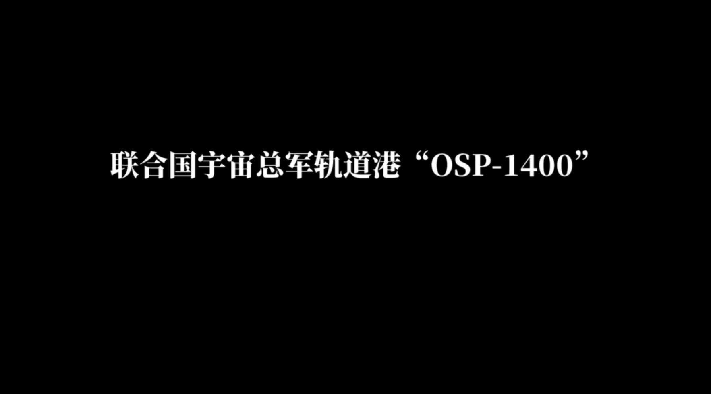</a></td>
    <td width="50%"><a href="docs/player/screenshots/photonflowers/cockpit-hud.jpg">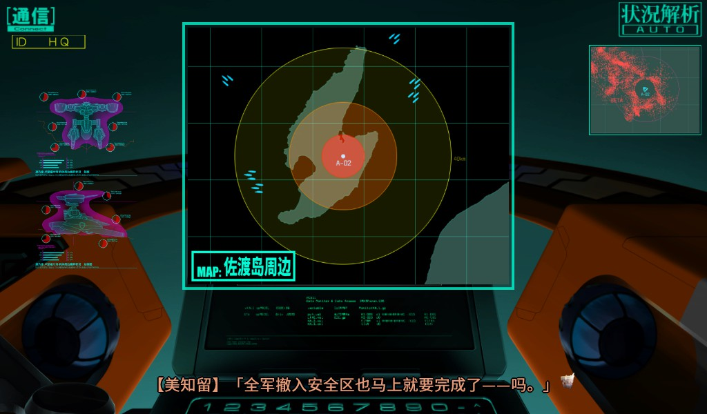</a></td>
  </tr>
</table>

#### 主界面、设置与游戏内操作菜单

菜单说明、设置选项和操作按钮均纳入汉化；游玩中的快速保存、读取、回看等菜单也有中文显示。

<table>
  <tr><th width="50%">TDA00 · 主界面中文菜单说明</th><th width="50%">TDA00 · 设置界面</th></tr>
  <tr>
    <td width="50%"><a href="docs/player/screenshots/tda00/title.jpg">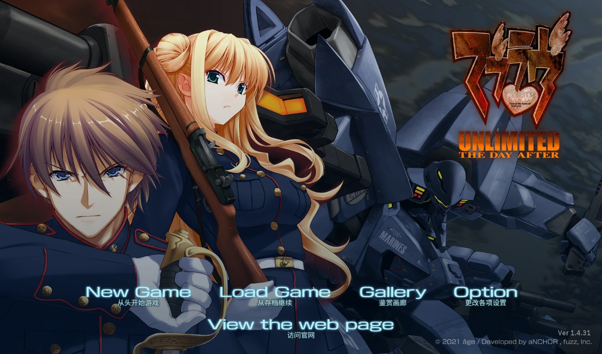</a></td>
    <td width="50%"><a href="docs/player/screenshots/tda00/settings.jpg">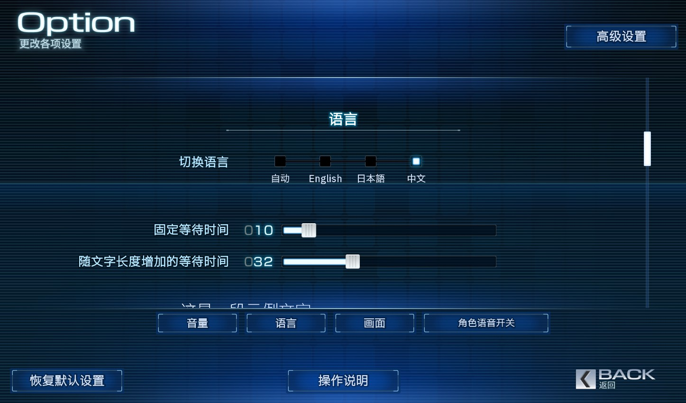</a></td>
  </tr>
</table>

<table>
  <tr><th width="50%">光子旋律 · 游戏内操作菜单</th><th width="50%">光子之花 · 设置与语言选择</th></tr>
  <tr>
    <td width="50%"><a href="docs/player/screenshots/photonmelodies/ingame-menu.jpg">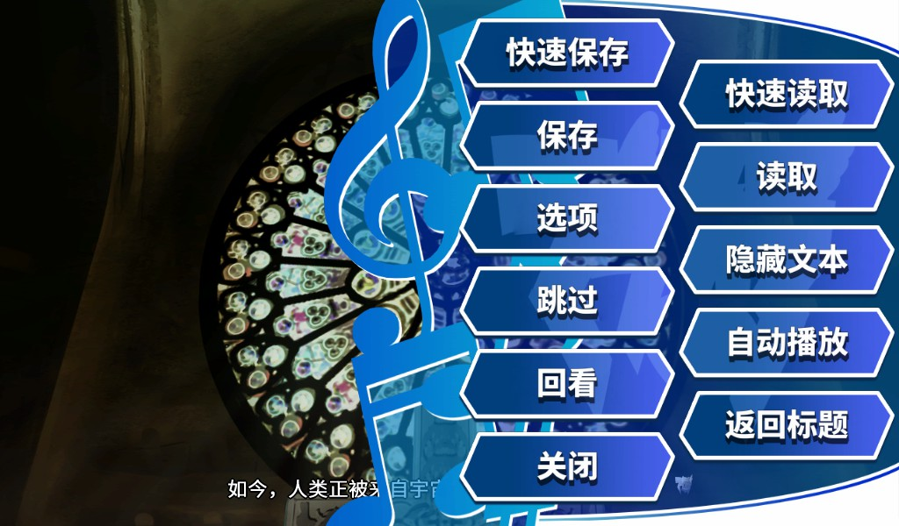</a></td>
    <td width="50%"><a href="docs/player/screenshots/photonflowers/settings.jpg">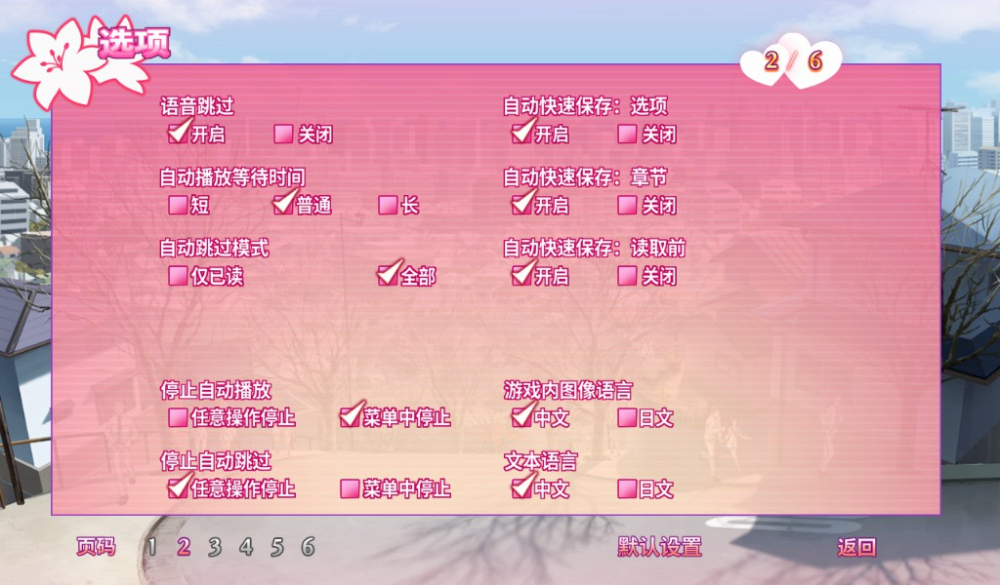</a></td>
  </tr>
</table>

#### 开场字幕与篇章标题

开场多行字幕和篇章标题图片也纳入汉化，并处理长句换行与排版。

<table>
  <tr><th width="50%">TDA00 · 多行长字幕</th><th width="50%">光子之花 · 《雨舞者》篇章标题</th></tr>
  <tr>
    <td width="50%"><a href="docs/player/screenshots/tda00/subtitles-long.jpg">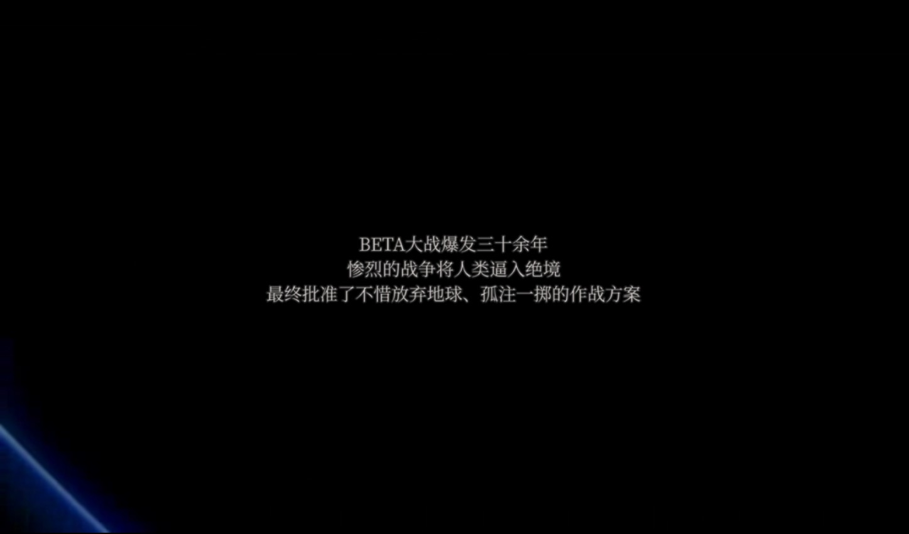</a></td>
    <td width="50%"><a href="docs/player/screenshots/photonflowers/rain-dancer-title.jpg">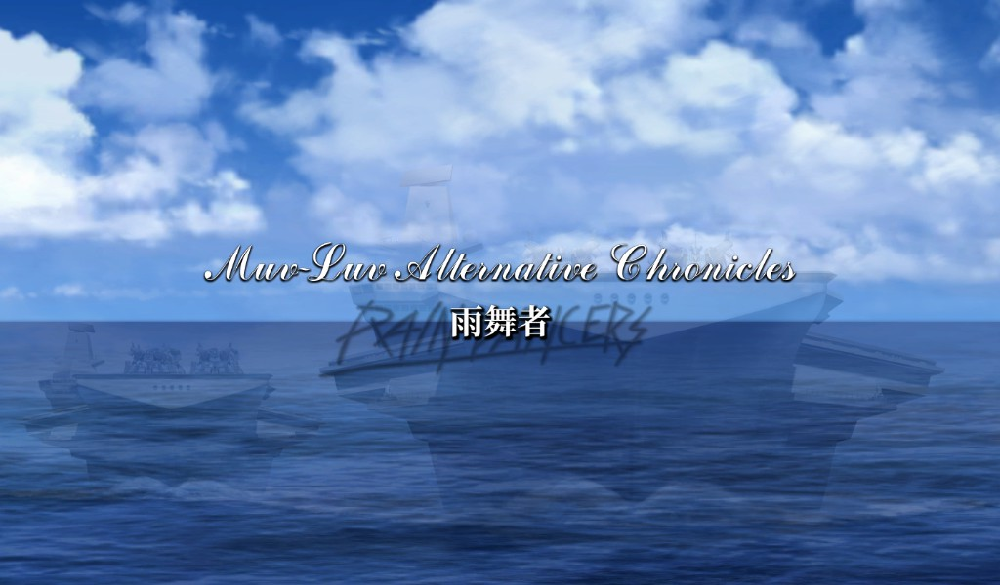</a></td>
  </tr>
</table>

#### 保留日语原作的振假名表现形式

**保留日语原作的振假名表现形式**，正文与对应旁注一并汉化。
TDA00 展示“地球／故乡”的双层表达；光子之花展示剧情正文与上方旁注的中文排版。

<table>
  <tr><th width="50%">TDA00 · 字幕中的振假名</th><th width="50%">光子之花 · 剧情中的振假名</th></tr>
  <tr>
    <td width="50%"></td>
    <td width="50%"><a href="docs/player/screenshots/photonflowers/dialogue-ruby.jpg">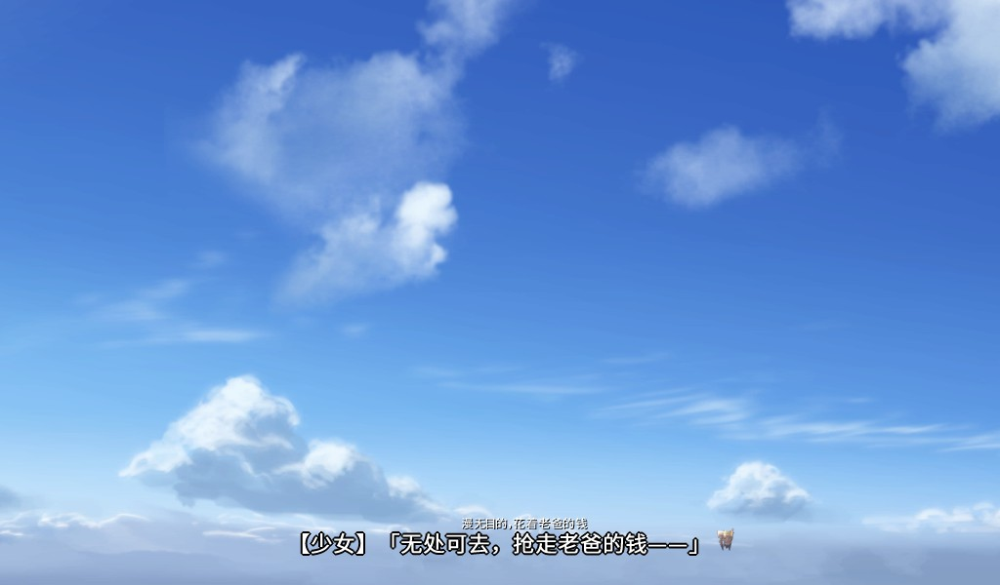</a></td>
  </tr>
</table>

#### 剧情正文与人物名称

中文正文、说话人名称及长句换行与多行排版。

<table>
  <tr><th width="50%">TDA00 · 中文正文</th><th width="50%">光子之花 · 中文正文</th></tr>
  <tr>
    <td width="50%"><a href="docs/player/screenshots/tda00/dialogue.jpg">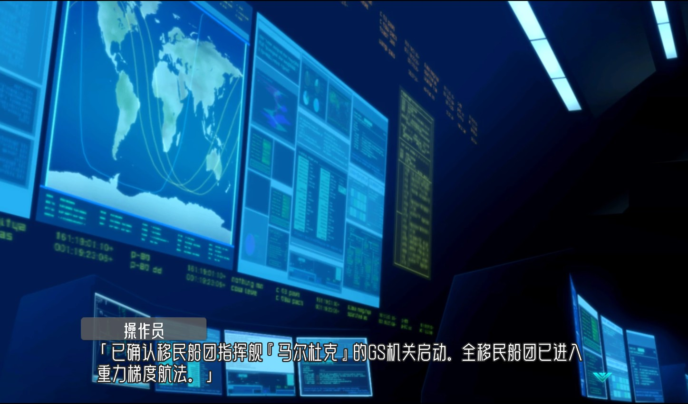</a></td>
    <td width="50%"><a href="docs/player/screenshots/photonflowers/dialogue.jpg">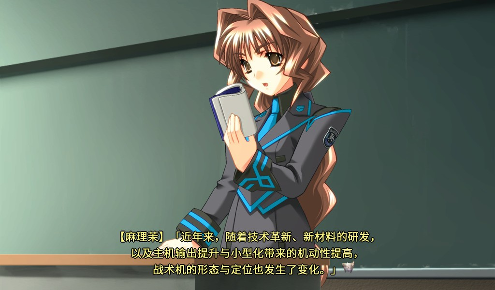</a></td>
  </tr>
</table>

以上画面采集于 **2026-09-30**，点击图片可查看原图。
**接近完整汉化，持续补完遗漏。** 各作仍可能有原文残留或显示问题，发现后继续修正、补齐。
[查看全部二十三张截图、各作已知限制与图片说明](docs/player/screenshots.md)。

### 作品名称与常用简称

| 中文名与简称 | 英文名／日文名及常见写法 |
| --- | --- |
| TDA00、TDA01、TDA02、TDA03 | Muv-Luv UNLIMITED: The Day After；TDA 00–03、episode:00–03；マブラヴ アンリミテッド ザ・デイアフター |
| 帝都燃烧、帝都燃烧篇 | The Imperial Capital Burns - Muv-Luv Alternative Total Eclipse；帝都燃ゆ；Teito Moyu |
| 光子之花、PF | Muv-Luv photonflowers*；マブラヴ photonflowers* |
| 光子旋律、PM | Muv-Luv photonmelodies*；マブラヴ photonmelodies* |
| 君望、你所期望的永远、Kiminozo | Kimi ga Nozomu Eien ~Enhanced Edition~；君が望む永遠；附加篇 Another Episode Collection+ |

各作对应不同补丁，请按作品下载。[完整名称与版本区别](docs/player/game-names.md)。

### 其他作者的汉化入口

**ATE／TE（Muv-Luv Alternative Total Eclipse Remastered，全蚀／全蚀篇）**
的 Steam 汉化由 **主任保护协会** 制作与发布，不计入本项目制作的七部补丁。
日文作品名为「マブラヴ オルタネイティヴ トータル・イクリプス」。

→ **[前往鲲 Galgame 原发布入口下载 ATE 汉化](https://www.moyu.moe/galgame/5364?tab=resource)**
· [作者补丁说明页](https://www.moyu.moe/resource/9330)

2026-09-20 核对时，作者发布的版本为 **v2.1**；原说明标注适用于 Steam Remastered
**V1.027 及以下版本**，不兼容旧光盘版。作者说明其采用 AI 翻译与人工 N1 精修。
具体适用条件、安装方法、更新与使用限制均以原发布页为准，问题请在原发布页反馈。

此处仅提供原页面链接，不在本仓库上传、修改或重新打包该补丁。
**ATE 正篇与帝都燃烧是不同作品，两者补丁不能混用。**

### 光子之花 / 光子旋律安装

Steam 语言设为 **English（英语）**，等待下载完成并退出游戏。解压对应 ZIP，双击 EXE，点击“安装汉化”。无需先安装旧补丁。

光子之花、光子旋律均不创建备份、不附卸载器。恢复原版时保留存档，通过 Steam 卸载、清除对应游戏目录的汉化残留，再重新下载；不要清空整个 Steam 目录。详见[玩家指南](docs/player/README.md)。

本次校对及反馈致谢：**柚子コショウ**。详见[两款 BETA 0.1.2 更新说明](docs/project/photon-beta012-proofreading.md)。

### AGE2 安装与恢复

TDA00—03 与帝都燃烧均支持一键安装和手动复制。解压后包含 `安装说明.txt`、`root`、`game` 和安装器四项，任选一种方式安装；手动安装无需运行任何生成工具。启动游戏后，在设置中选择中文。

本次仅增加安装方式，汉化内容不变，已正常安装上一版的玩家无需重装。恢复原版前先切回英文或日文，并保留存档。具体复制路径和恢复步骤见[玩家指南](docs/player/README.md)。

### 项目状态

- **[《君望》Steam版](AGE2/games/kiminozo/README.md)：**汉化正在制作中，目前在做文本校对和UI、图片汉化，暂未发布补丁。项目范围、目录与进度见[君望项目入口](AGE2/games/kiminozo/README.md)。

光子之花／光子旋律的技术来源分类、上游版本、82 项技术职责与完整路线演变，详细请见 **[技术来源分类与完整蓝图](docs/research/photon/README.md)**。

- **TDA00—03、帝都燃烧篇：**2026-09-20 BETA 更新已纳入本轮校对、术语和排版修正，采用独立中文槽与有版本检查的安装器；仍在持续实机验证。
- **光子之花、光子旋律：**已正式公开发布 **BETA 0.1.2**，光子之花、光子旋律各有独立安装包。旧 Photon 图片研究资产仍不是游戏安装包。

### 问题反馈

安装遇到问题、发现错字或想交流，欢迎加入 **QQ 交流群：273626767**。
不熟悉 GitHub 也可以直接进群反馈，尽量附上游戏名、补丁版本、截图和前后台词。

- [报告安装、启动、文本、图片或字体问题](https://github.com/RepressedAlliance/AgeReVerse/issues/new?template=bug-report.yml)
- [提交有日文原文依据的翻译修正](https://github.com/RepressedAlliance/AgeReVerse/issues/new?template=translation-review.yml)
- [查看参与方式、贡献者与致谢](.github/CONTRIBUTING.md)

### 关于 AI 翻译与人工校对

**本项目各作的汉化文本均有 AI 参与翻译，但不是 AI 直出。**
我们先以日文原文为依据，通读剧情、梳理人物关系并建立术语基线，再按场景初译；
随后独立进行第二轮日文对照复核，记录保留、修改和待确认项，解决疑点、统一术语，
随后进行资源写回、技术检查和实机验证；**制作流程的最后一步是由我人工检查、修改发现的
错误，确认修改结果后再发布对应版本。** AI 复核与人工审核分别记录，不能互相替代。

**玩家目前下载到的补丁，已经包含我在相应版本发布前参与审核、确认并落实的修改。**
从译文措辞、人物称谓和术语取舍，到文本缺漏、换行排版、图片文字和游戏内显示问题，
我在制作和测试过程中结合原文依据、校对意见与实际反馈检查问题，提出修改要求、确认
采用方案，并跟进修正结果，再将修改纳入对应发布包。AI 协助分析与执行，具体取舍和
最终发布由我负责；发布后也会继续收集反馈、修正问题。

已确认的审核与纠错会纳入对应发布包；具体变化见各作当前发布说明。

详细步骤见 **[按顺序阅读的翻译规范](localization-make-games-speak/text-ai-translation-worth-reading/README.md)** 和
[完整工作流](localization-make-games-speak/text-ai-translation-worth-reading/workflow.md)。这些是制作流程，不代表每个历史测试包都已完成
全文人工校对或全路线验证，译文仍可能存在错误。

TDA 的部分文本已经过人工校对。已发布版本包含上述审核与修正；此后新增的校对和修改
会继续同步到可维护文本中，是否进入某个下载包以对应发布说明为准。
感谢 **ScRm** 对 TDA00 的审核与校对，感谢 **ScRm、骁飞、Tsubaki-G** 对各篇文本的纠错与修订。
**《樱花盛开之前》的部分文本由“红桃皇后假说”提供，在此诚挚致谢。**

### 欢迎加入 ParaTranz 校对

**ParaTranz 主要用于发布后的协作校对与持续修订。** 通常先完成上述制作流程并发布补丁，
再由愿意参与的朋友加入项目、对照日文提出校对和修改；经维护者确认、检查后纳入后续版本。
这与发布前由我完成的人工检查和修正是两个阶段。ParaTranz 上的改文或同步到仓库的改文，
不会自动更新玩家已经下载的补丁。在制作品也可提前开放协作，开放项目不代表已有安装包。

如果你看得懂日语，愿意对照原文校对、修改译文或讨论术语，诚挚欢迎加入以下项目。
可以从熟悉的一句台词或一个场景开始，不必一次承担整章。
即使不懂日语，也欢迎反馈错字、语句不通顺、显示异常或游玩中遇到的问题；
可以加入 **QQ 群：273626767**，和我们交流、帮助补丁逐步完善。

| 校对范围 | 在线项目 |
| --- | --- |
| TDA00—03 | [加入 TDA 校对](https://paratranz.cn/projects/19505) |
| 帝都燃烧篇 | [加入帝都燃烧篇校对](https://paratranz.cn/projects/20659) |
| 光子之花 | [加入光子之花校对](https://paratranz.cn/projects/20660) |
| 光子旋律 | [加入光子旋律校对](https://paratranz.cn/projects/20661) |
| 君望本篇与附加篇 | 尚未开放公开全文校对；[查看制作进度](AGE2/games/kiminozo/README.md) |

---

## 第二部分 · 制作与研究 / Localization & Research

本仓库同时公开可复用的翻译、术语、图片、字体、工具和逆向研究，方便其他汉化者、
开发者和其他语言团队继续维护：

| 内容 | 入口 |
| --- | --- |
| 全部公开成果与研究索引 | **[制作与研究入口](docs/research/README.md)** |
| 学习并复用文本、图片、字体、一致性和多人校对方法 | **[游戏本地化｜让游戏说你的语言](localization-make-games-speak/README.md)** |
| TDA／帝都的 AGE2、FPD、EGPACK 与松散覆盖 | [AGE2 工作区](AGE2/README.md) |
| 君望本篇与附加篇的文本、术语和 UI 图片制作 | [君望项目（制作中）](AGE2/games/kiminozo/README.md) |
| Photon 的 RIO、RUO、CRsa、图片和运行时 | [rUGP 工作区](rUGP/README.md) |
| 文本、图片、字体和工具的具体位置 | [资产地图](docs/research/asset-map.md) |

<strong>English · Tools, localization workflow and research — expand here</strong>

### What you can reuse

This repository publishes localization tools, maintained translation tables, terminology,
image and font workflows, and reverse-engineering findings for the Muv-Luv series.
The Chinese player downloads are listed in the first part of this README.

| Topic | English-friendly starting point |
| --- | --- |
| Learn and adapt the localization method | **[Game Localization — Make Games Speak Your Language](localization-make-games-speak/README.md)** |
| Public results and current limitations | [Research index](docs/en/research-index.md) |
| Text, image, font and tool locations | [Asset map](docs/en/asset-map.md) |
| Translation and independent review | [Complete English workflow](localization-make-games-speak/text-ai-translation-worth-reading/workflow.en.md) |
| Korean, Russian or another target language | [Starting a new language](localization-make-games-speak/text-ai-translation-worth-reading/new-locale.md) |
| Ordered standards | [Standards and reading order](localization-make-games-speak/text-ai-translation-worth-reading/README.md) |
| TDA / Imperial: FPD, EGPACK and loose overlays | [AGE2 workspace](AGE2/README.md) |
| Kiminozo and Another Episode Collection+: work in progress | [Project scope and structure](AGE2/games/kiminozo/README.md) |
| Photon: ICI, RIO, RUO and runtime tooling | [rUGP workspace](rUGP/README.md) |
| Proofreading synchronization | [ParaTranz workflow](localization-make-games-speak/paratranz-keep-improving-together/README.md) |

AI participates in translation across the project. The workflow establishes Japanese story context
and terminology before a first translation, then independently reviews each candidate, resolves
questions, and performs engine-specific checks. AI review is not human proofreading or proof of
full-route in-game validation. Some TDA passages have been human-proofread; some text in
*Before the Cherry Blossoms Bloom* was provided by 红桃皇后假说.

To work on another language, reconstruct Japanese source from your own lawful game copy, preserve
stable identities and source hashes, and create separate target-language files. The current tools
are reusable components; they do not yet provide a universal one-command finished patch pipeline.

## 贡献者与致谢

项目由 [RepressedAlliance](https://github.com/RepressedAlliance) / 压抑同盟 发起和维护。
我们从“主任保护协会”那里学到了 **通过松散文件结构覆盖游戏资源的方法**。
正是这份启发，让我们迈出了汉化的第一步，对此我们由衷感谢。
后续资源提取、翻译、工具开发与补丁制作由本项目自行完成；具体技术参考与历史对照记录另行列明。
感谢 GARbro、AFHook／AFEditor、rugptools、alterdec、RioX、FatePackageManager
及其他成熟补丁项目提供公开技术先例。OpenAI Codex 和图像模型
在维护者指挥与审核下参与了部分代码、文档、分析、检查和图片工作。

感谢 **ScRm** 对 TDA00 的审核与校对，以及 **ScRm、骁飞、Tsubaki-G** 对各篇文本的纠错与修订；感谢 **柚子コショウ** 参与 PF／PM 校对并提供修正建议，**红桃皇后假说** 提供《樱花盛开之前》的部分文本，**子冰** 对 TDA01 提供反馈，以及 **木之老师** 对君望旧译、术语和用典核对的帮助。ParaTranz 记录中的 ScRemilia、Tsubaki-G、X1AOFEI 也在[贡献者总表](docs/project/CONTRIBUTORS.md)中保留署名。

完整贡献范围、责任边界与参考项目见 **[贡献者与致谢](docs/project/CONTRIBUTORS.md)** 和
[研究参考](docs/research/references.md)。

## 许可与内容边界

自写代码采用 [MIT License](LICENSE)。MIT 不自动覆盖游戏内容、翻译文本、字体、衍生图片、
发布包或第三方组件；详见[内容与发布政策](docs/project/asset-and-release-policy.md)、
[第三方来源](docs/legal/THIRD_PARTY.md)与[法律说明](docs/legal/NOTICE.md)。
