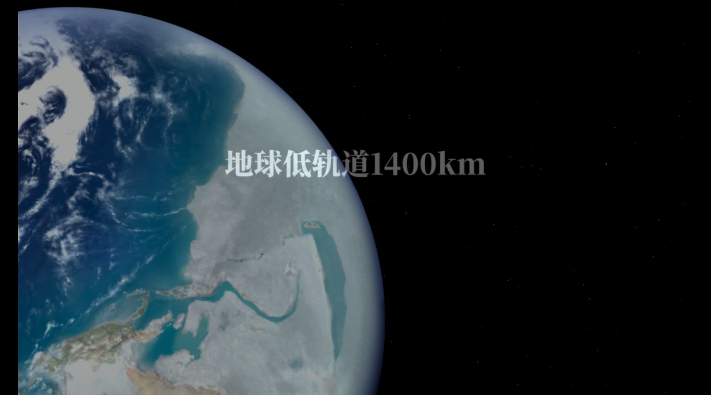
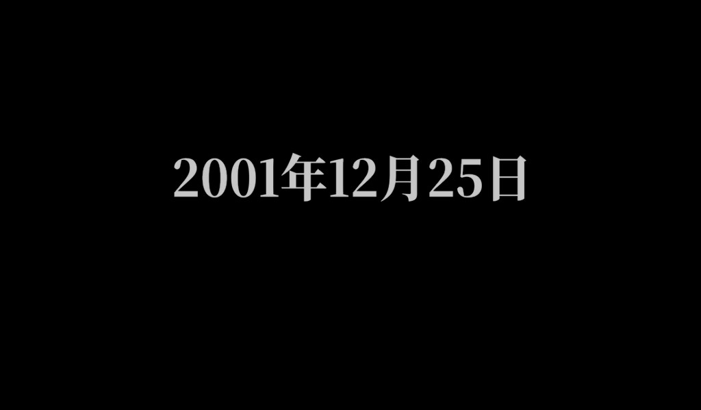
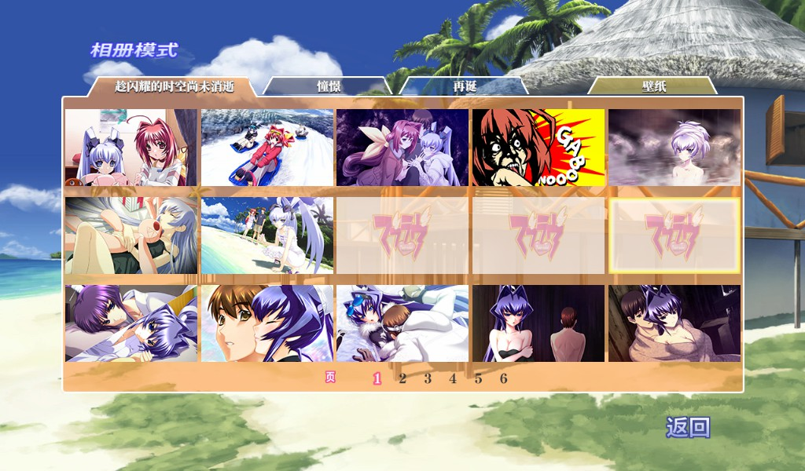

# 汉化范围与中文实机截图

[返回首页](../../README.md#部分作品实机预览) · [下载、安装与排错](README.md) · [问题反馈](../../README.md#问题反馈)

## 接近完整汉化，持续补完

**本项目以完整汉化为目标，已发布的七部补丁接近完整覆盖剧情正文、菜单与设置、字幕及各类图片文字。**
可编辑文本与嵌在图片中的文字一并进行中文化，包括标题、按钮、说明、地图、战术标注、年表、地点提示、手写道具和演出素材文字，
同时完善中文字体、换行、长字幕和原作的特殊排版。

各作资源和表现方式不同，以下选取 TDA00、TDA03、光子之花和光子旋律，展示两个引擎中的不同汉化类型，并非每作都包含相同界面或内容。
截图展示选定场景中的实际效果，不代表所有场景都已逐项验证。“接近完整汉化”也不等于全文人工校对；
AI 翻译、制作阶段的人工审核，以及发布后的协作校对，详见[翻译与校对说明](../../README.md#关于-ai-翻译与人工校对)。

**仍可能存在遗漏、原文残留或显示问题，发现后会继续修正、补齐并发布更新。**
目前已知：光子之花部分页面偶发英文，光子旋律《再诞》片尾动画内嵌英文说明尚未汉化。
详见[当前已知问题](../project/photon-beta012-proofreading.md)和[各作发布说明](../../README.md#游戏下载)。
君望仍在制作中；另收录的 ATE 为其他作者的补丁，不属于本页展示范围。

截图采集于 **2026-09-30**，为 Steam 游戏内截图，保持原图比例；点击图片可查看原图。
当前公开补丁版本与下载入口见[下载表](../../README.md#游戏下载)。

## TDA00（AGE2）

### 主界面

主菜单保留原有视觉风格，中文说明显示在对应操作下方。

### 设置界面

中文设置选项、操作按钮与语言选择。

### 长字幕

开场多行中文字幕。

### 保留原作振假名的字幕排版

**保留日语原作的振假名表现形式**：正文上方仍显示对应旁注。
本例将正文与旁注一并汉化，保留“地球”与“故乡”的双层表达；这里保留的是原作的表现形式。
建议点击原图查看正文与旁注的排版效果。

### 正文汉化

说话人名称、中文正文与长句换行。

## TDA03（AGE2）

### 场景地点提示

“联合国宇宙总军轨道港 OSP-1400”的中文地点提示。

### 地球低轨道位置提示

演出画面中的“地球低轨道1400km”位置提示。

### 战术图中文标注与说明

“核攻击”、基地名称与 NORAD 说明采用中文标注；画面保留原图中的日文。

## 光子之花（PF，rUGP）

### 故事选择与图片标题

故事介绍、章节按钮及图片中的标题文字。

### 年表与篇章入口

年表中的密集文字与右侧篇章标题。

### 设置界面

自动播放、快速保存等设置；图像语言与文本语言可以分别选择。

### 手绘地图文字

地图中的位置、地形与行动标记也纳入汉化。

### 机械说明图

机械示意图中的说明文字。

### 篇章主界面

《赎罪》的篇章标题与开始、继续、返回菜单。

### 正文汉化

说话人名称、中文对白与多行排版。

### 《雨舞者》篇章标题

篇章标题图片中的中文文字。

### 剧情中的振假名

正文与上方旁注一并汉化，保留日语原作的振假名表现形式与双层排版。

### 日期提示

“2001年12月25日”的日期卡。日期写法在中日文中相近，作为场景提示的补充画面展示。

### 驾驶舱演出中的文字

动态演出中的一帧，展示“通信”“状况解析”“佐渡岛周边”等中文标签。
本图展示该帧文字的实际效果；CRmt／CRmti 图片资源的处理方法见[技术说明](../../rUGP/docs/crmt-family.md)。

## 光子旋律（PM，rUGP）

### 手写道具图片文字

纸张上的姓名、军衔和手写旁注也进行中文处理，保留纸张、笔迹与涂鸦的画面风格。

### 游戏内操作菜单

快速保存、快速读取、保存、读取、回看、自动播放等操作按钮。

### 相册模式

篇章页签、壁纸入口、页码和返回按钮的中文显示。

### 篇章选择

《憧憬》《再诞》《趁闪耀的时空尚未消逝》的中文篇章标题与返回按钮。

## 发现遗漏时

欢迎通过 [GitHub 问题反馈](https://github.com/RepressedAlliance/AgeReVerse/issues/new?template=bug-report.yml)
或 QQ 群 **273626767** 提供游戏名、补丁版本、截图和场景位置，帮助我们继续补完。

## 图片归属

这些截图用于展示非官方汉化补丁的实机效果，游戏画面及原有内容归相应权利人所有。
仓库代码的 MIT 许可不覆盖截图或游戏内容；截图不是可安装的游戏资源，也不代表官方认可。
详见[内容权利说明](../legal/NOTICE.md)。
